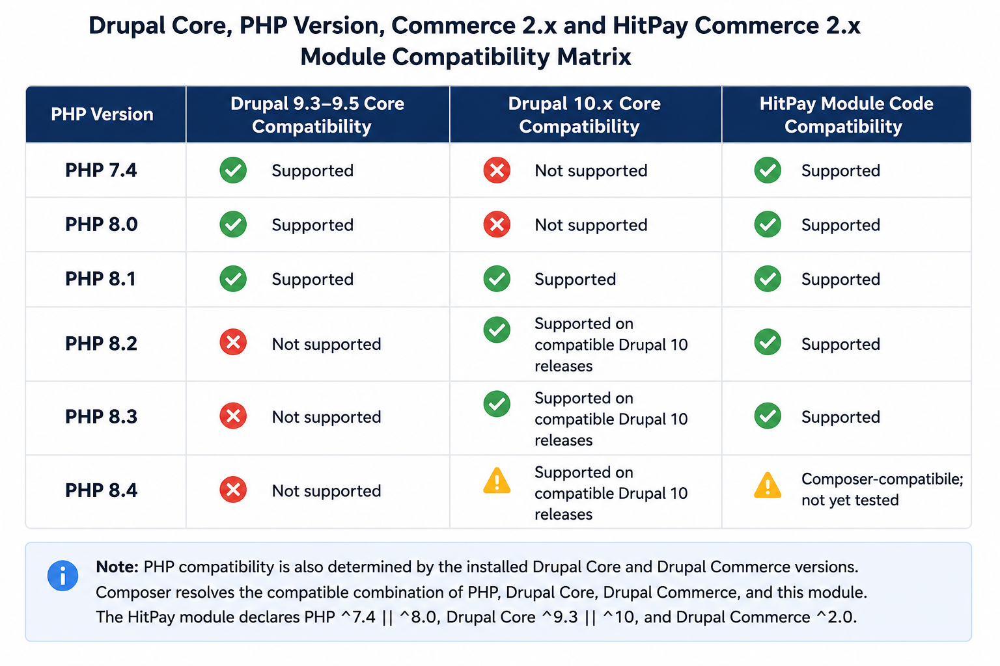

# HitPay Payment Gateway for Drupal Commerce 3.x


HitPay Payment Gateway provides integration between **Drupal Commerce 3.x** and **HitPay**, enabling merchants to accept online payments using HitPay Hosted Checkout.

The module supports secure webhook-based payment processing, automatic webhook lifecycle management, full and partial refunds, sandbox and live environments, and optional debug logging for HitPay API requests and responses.

---

## Features

* HitPay Hosted Checkout
* Payment processing through verified webhooks
* Automatic webhook lifecycle management
* Commerce payment creation
* Customer return handling
* Full and partial refunds
* Sandbox and live environments
* Optional HitPay API debug logging
* Drupal 10.3 or later support and Drupal 11 support
* Drupal Commerce 3.x support

---

## Requirements

* Drupal 10.3 or later within the Drupal 10 release series, or Drupal 11
* Drupal Commerce 3.x
* PHP 8.2 or later
* Active HitPay merchant account
* HitPay API credentials



---

## Installation

### Option 1: Download from GitHub

Clone the repository into the `modules/custom` directory of your Drupal installation.

If the `custom` directory does not exist, create it first:

```bash
cd [DRUPAL-ROOT]/modules
mkdir custom
```

Then clone the repository:

```bash
cd [DRUPAL-ROOT]/modules/custom
git clone https://github.com/hit-pay/drupal-commerce-3x.git commerce_hitpay
```

Alternatively, download the ZIP archive from GitHub and extract it into the `modules/custom` directory.

Ensure that the module files are located at:

```text
[DRUPAL-ROOT]/modules/custom/commerce_hitpay
```

`[DRUPAL-ROOT]` refers to the Drupal document root containing directories such as `core`, `modules`, `sites`, and `themes`.

Enable the module using Drush:

```bash
drush en commerce_hitpay
```

Alternatively, enable the module through the Drupal administration interface:

```text
Administration
→ Extend
→ HitPay Payment Gateway
```

### Option 2: Install with Composer

Register the GitHub VCS repository:

```bash
composer config repositories.commerce_hitpay vcs https://github.com/hit-pay/drupal-commerce-3x
```

Install the development branch:

```bash
composer require hitpay/commerce_hitpay:dev-main
```

Then enable the module:

```bash
drush en commerce_hitpay
```

When stable Git tags are available, install a tagged release instead:

```bash
composer require hitpay/commerce_hitpay:^1.0
```

Or use the Drupal administration interface:

```text
Administration
→ Extend
→ HitPay Payment Gateway
```

---

## Configuration

Navigate to:

```text
Commerce
→ Configuration
→ Payment Gateways
```

Create a payment gateway and select **HitPay**.

Configure:

* API Key
* Mode

  * Sandbox
  * Live
* Enable debug logging (optional)

Save the payment gateway.

The module automatically:

* Validates the supplied API credentials.
* Registers and synchronizes the HitPay webhook.
* Removes duplicate webhooks registered for the same endpoint before creating a replacement.
* Stores the webhook ID and webhook salt.
* Repairs missing or externally deleted webhooks.
* Recreates the webhook when required to recover missing webhook credentials.
* Attempts to remove the previous webhook when API credentials or environment change.

No manual webhook registration is required.

---

### Debug Logging

Enable **debug logging** when troubleshooting communication with the HitPay API.

When enabled, the module logs:

* HitPay API request method and endpoint.
* Sanitized request payloads.
* HTTP response status.
* Sanitized API response bodies.
* API error responses and request failures.
* Sandbox or live environment information.

Sensitive values, including webhook salts and customer information, are redacted from debug logs.

Debug logging should normally remain disabled in production and enabled temporarily when troubleshooting.

---

## Payment Flow

1. The customer places an order and selects HitPay.
2. Drupal Commerce creates a HitPay payment request.
3. The customer is redirected to HitPay Hosted Checkout.
4. The customer completes the payment.
5. HitPay sends a signed webhook notification.
6. The module verifies the webhook signature and payment notification.
7. A Commerce payment is created for the successful HitPay payment.
8. The customer return request continues the Commerce checkout flow.

> **Note:** The customer return request and webhook notification are independent HTTP requests and may arrive in either order. Payment completion is determined from the verified HitPay payment notification rather than relying solely on the browser return request.

---

## Webhook Management

The module automatically manages the HitPay webhook lifecycle.

When the payment gateway is saved, the module:

* Creates a webhook when no stored webhook exists.
* Removes stale duplicate webhooks registered for the same endpoint before creating a replacement.
* Verifies that the stored webhook still exists remotely.
* Synchronizes webhook configuration when the endpoint changes.
* Recreates externally deleted webhooks.
* Recreates the webhook when the locally stored webhook salt is missing.
* Attempts to delete the previous webhook when API credentials or environment change.
* Stores the webhook ID and webhook salt required for future synchronization and signature verification.

Webhook synchronization failures are logged and prevent invalid webhook configuration from being silently accepted.

Incoming webhook requests are signature-verified before payment notifications are processed.

---

## Refunds

Refunds are integrated with Drupal Commerce and can be issued from the Commerce payment administration interface.

Supported operations:

* Full refunds
* Partial refunds

Before submitting a refund, the module:

* Verifies that the payment is refundable.
* Validates the requested refund amount.
* Verifies that the remote HitPay payment ID is available.

After a successful HitPay refund:

* The Commerce refunded amount is updated.
* Partial refunds set the payment state to `partially_refunded`.
* Full refunds set the payment state to `refunded`.
* Available HitPay refund metadata is stored on the order.

If HitPay successfully creates the refund but Drupal cannot persist the corresponding local payment or order changes, the module logs a critical error and warns administrators not to retry the refund blindly.

---

## Testing

Use Sandbox mode to test the integration without processing live payments.

Recommended test workflows:

* API credential validation
* Hosted Checkout redirection
* Successful payment
* Customer return handling
* Webhook signature verification
* Commerce payment creation
* Missing remote webhook recovery
* Duplicate webhook cleanup
* Missing webhook salt recovery
* Webhook URL synchronization
* API credential and environment changes
* Invalid webhook signature handling
* Full refund
* Partial refund
* Invalid refund amount
* Missing remote payment ID
* Debug request and response logging

> **Deployment Check:** Before enabling Live mode, verify that the production Drupal site uses HTTPS and can receive incoming HitPay webhook requests.

---

## Troubleshooting

### Enable Debug Logging

Temporarily enable **debug logging** in the HitPay payment gateway configuration to inspect sanitized HitPay API requests, responses, HTTP status codes, and request failures.

Review Drupal log messages under the `commerce_hitpay` logger channel.

Disable debug logging after troubleshooting, especially on production sites.

### Payment is not created

Verify that:

* The HitPay webhook can reach the Drupal site.
* The configured API key and environment are correct.
* The webhook signature is valid.
* The expected HitPay payment event is received.
* Drupal logs do not contain webhook processing or payment creation errors.

Enable debug logging to inspect HitPay API communication when additional diagnostics are required.

### Webhook synchronization failed

Verify that:

* The configured API key belongs to the selected environment.
* The Drupal webhook endpoint is publicly reachable.
* HitPay webhook API requests are succeeding.
* The stored webhook configuration has not been manually modified.

Enable debug logging and review the HitPay API request and response details.

### Webhook verification failed

Verify that:

* The stored webhook salt belongs to the registered HitPay webhook.
* The request body is not modified before signature verification.
* The correct HitPay environment and credentials are configured.
* Reverse proxies or other infrastructure are not modifying the webhook request.

### Customer returns from HitPay but payment is not completed

The browser return request does not replace webhook payment verification.

Verify that the corresponding HitPay webhook was received, verified, and successfully processed.

### Refund failed

Verify that:

* The Commerce payment is refundable.
* The payment contains the correct remote HitPay payment ID.
* The requested amount does not exceed the remaining refundable amount.
* The API credentials belong to the configured environment.

Enable debug logging to inspect the HitPay refund API request and response.

---

## Support

For bug reports, feature requests, and other issues, use the GitHub issue tracker for this project.

When reporting an issue, include:

* Drupal version
* Drupal Commerce version
* PHP version
* Module version or Git commit
* HitPay environment (Sandbox or Live)
* Relevant Drupal log messages
* Steps to reproduce the issue

⚠️ **Security Warning:** Do not include API keys, webhook salts, customer payment information, or other sensitive credentials in public issue reports.

---

## Changelog

See `CHANGELOG.md` for version history and release notes.

---

## License

This project is licensed under the GNU General Public License v2 or later (`GPL-2.0-or-later`).

See the `LICENSE` file for details.
